Minishell is one of the largest projects in the 42 educational program. It provides a great opportunity to create your own mini version of the Bash shell from scratch using the C programming language. Honestly, most students who lacked programming experience before joining 42 find this project intimidating because it contains many edge cases that aren't covered in the subject but must be handled on your own. However, I can say that anyone can complete this project.

It's not hard. It's just huge.  

## A bit context

A significant part of the 42 Common Core curriculum is learning how modern technologies work under the hood. Some projects offer a unique opportunity to explore how operating systems function. In these projects, you’ll learn about parallel programming, file descriptors, temporary files, and the basics of system administration. So, at the very least, students starting this project know how to use the command terminal!

## Let's start!

```mermaid
flowchart TD

A["Bash 🖼️"] --> B["Parsing 📁"]
A --> C["Execution 🔨"]
```



Minishell is a partner project. Students typically divide it into two main parts:
                 
* parsing  - receive and storage information before and during the program work. 
* execution  - provides usability of built-in and external programs. 

But it's `only one type` of dividing responsibility inside the team. I know cases where students make `both parts together`. In my opinion, it's more difficult, because making this project in a proper way the first time is almost impossible. The subject of the project gives you `only basic view of the shell functions` and some time after starting the implementation, you begin to encounter errors, leaks or another mistakes. And in case, when the code that related with error is not yours, it's very hard to understand the programming logic of your partner but you need to fix it. Not having clear logic generates misunderstandings and more errors and bugs in the end.

When each student `takes responsibility from his part` is better. If a teammate finds any mistake that is not from his part he just make a bug report and send it to his teammates. He doesn't need to fix it by himself because it's not his responsibility.

## The shell user experience

#### Redirections

The shell experience starts at the command prompt, where users can type any command they want to execute. Besides commands, users can also `use input and output redirection`, which allows them to store and use the results of command execution. There are four basic types of redirection that we need to implement in this project:

- `>` - create or clean and write output data to the file
- `>>` - create if it's needed and write output data to the end of file
- `<` - read input data from the file
- `<<` - create a temporary file that you can fill until you type a limiter and use collected data as input

Command line may contain a lot of redirection calls, but only last one matters. For example:

```bash
< infile1 << "limiter" grep "test" >> outfile1 > outfile2
```

There we have all of redirection type. First, bash will check existence of `infile1` and create `outfile1` and `outfile2` if needed. Finally shell will open an input for the temporary file that the user can fill until he write the "limiter" string. But what about the data? From which source will grep receive input and where it will write an output? Exactly latest one matters! Command grep will take a data `from temporary file` and will `fill the outfile2` as an output file. That how it works.

#### Pipe

In addition, the user may use the pipe `|` tool. It allows the output of one command to be transferred as input to another command.. For example:

```bash
ls | grep "test" | wc -l
```

This command will count folders and files that name contain "test" string. How it works:

1. `ls` - display a list of files and folders in current folder
2. `grep "test"` - filter them by name
3. `wc -l` - count lines from input

Together with pipes the commands transfer data like this:


> If before pipe user enter the output redirection, its file will be opened, but not used to write the data. Next command will receive data from the pipe (only last matters).

> If after pipe user enter the input redirection, the pipe data will be ignored. Next command will receive data from the input redirection (only last matters).

#### Commands

Terminal shell have 2 types of commands: 

1. `Built-in` - commands that are part of the shell
2. `External` - commands that are stored in the directories of the operating system

Basically, external commands are not located in the current folder. To use them, the shell needs to parse the `PATH` environment variable, which contains a list of directories with public programs, separated by the ':' character.

> If the PATH environment variable is not defined or does not include the path to the folder with the required command, the program will not be found.

Built-in commands `should always be available for use`. Below is a list of built-in commands that need to be implemented:

| Command | Argument    | Description                                                       |
| ------- | ----------- | ----------------------------------------------------------------- |
| echo    | string      | Print the string to the output (environment variables is allowed) |
| cd      | folder path | Change current directory to another one by folder path            |
| pwd     | -           | Display absolute path of the current folder                       |
| export  | name=value  | Create environment variable with name and value                   |
| unset   | name        | Remove environment variable by name                               |
| env     | -           | Display list of the environment variables                         |
| exit    | status code | Exit from the shell with status code                              |

#### Signals

Provide the ability to interrupt command execution or shell operation. In this project, we need to handle the following types of signals:

1. `CTRL + D` - interrupt the shell work
2. `CTRL + C` - interrupt the command execution (if command is not executed should display new prompt)
3. `CTRL + \` - doing nothing (really)


## How is works?

### Parsing of the user input

Imagine that the user has opened the minishell for the first time and wants to type a very complicated command prompt:

```bash
ls | < infile grep test | wc -l > outfile1 > outfile2 
```

As you can see, it's just a string with many arguments and words separated by spaces. But how do we detect commands or instructions that the shell needs to execute?

First, we need to `split this string by the | character`, which represents a pipe. Why is this needed? Because each part separated by a pipe should be executed in parallel using child processes in the execution phase. After splitting, we need to create an Abstract Syntax Tree and populate it:


This structure follows a very simple rule for filling: if a node has child nodes, it is a `pipe`; if it doesn't, it is a `command`. At this step, we can determine how many child processes our program will use to execute the user's prompt (3 processes). The next step is to extract the input and output redirections from the command nodes.

As I mentioned earlier, we have 4 types of redirections to implement: `>>`, `>`, `<`, `<<`. After each redirection symbol, there should be a corresponding argument that provides additional information about the destination or source file, or a limiter string for the temporary file. If this is not present, the prompt becomes invalid, and the shell should display an error.

Using this rule, we can easily `extract all kinds of redirections` from the command nodes. While extracting, don't forget to check access to the required files. After extraction, our tree will look like this:


The final step is to make a connection between commands using the `pipe system call`. Why is it a system call? Because our program uses this function to request the OS to perform an action. In this case, the OS creates a temporary file and returns its file descriptors with read and write access. When the program uses the write file descriptor to record something into the temporary file, the program reading from the read file descriptor will automatically receive the newly written value.


>The max size of temporary file is 64KB (for someone it's very important to know). 

Using this tool, we can create a chain of paired connections between nodes. Finally, the Abstract Syntax Tree is ready to be used in the execution phase:


#### Execution

So, main preparation steps are finished, let's execute something!

First, we need to traverse the tree and `create a child process` for each command node. Why is this necessary? Let's talk about how to execute external commands and implement input and output redirections.

#### External command 

As I mentioned earlier, built-in commands are simply part of the shell code. This means they are very easy to execute. But what about external commands? For them, we need to use the `execve` function. This function receives the `path to the command and its arguments`, and if everything is correct, the executed program takes control of the current process. After execution, if the external command finishes with a success status code, the process will `terminate automatically`. Otherwise, we need to manually close the child process.

#### Redirections

To implement input or output redirection, we should use the `dup2` function. This function allows us to `change the source file for a file descriptor`. Essentially, every program starts with 3 file descriptors: 


As you can see, all file descriptors have the terminal as their source file. Using dup2, we can change their source:


For example, if we change the source for `STDOUT`, any message from `printf` will be redirected to a file or pipe. It is very important to note that we `cannot undo this change`. This is another reason to use child processes during execution.
#### Execution workflow

1. Run the child process for each command:
	1. Check if it is a built-in command or not.
	2. Set up input and output redirections.
	3. Clean up all unused data and close all file descriptors.
	4. If the command is a built-in, execute its function; otherwise, call the external program using `execve`.
	5. If the command is a built-in, exit with a status code; otherwise, handle the case where command execution fails.
2. Close all redirection file descriptors inside the parent process.
3. Wait for the completion of all commands and save their exit statuses. 

After these steps, the user prompt is executed. We should save the `exit status of the last command`. This value is required for using the echo built-in command with the `$?` variable.

### Conclusion

To wrap things up, building a mini shell is all about breaking down tasks like parsing user input, running commands, and handling file descriptors. By getting the hang of built-in vs. external commands and how input/output redirection works, you’ll be well on your way to creating a shell that works like the real deal.

Using child processes helps keep things organized and makes it easier to handle errors. Plus, understanding tools like the Abstract Syntax Tree, dup2 for redirection, and execve for executing commands is key to making everything tick.

In the end, making a mini shell not only sharpens your programming skills but also gives you a taste of system-level programming, setting you up for even bigger challenges down the road!