Minishell is one of the largest projects in the 42 educational program. It provides a great opportunity to create your own mini version of the Bash shell from scratch using the C programming language. Honestly, most students who lacked programming experience before joining 42 find this project intimidating because it contains many edge cases that aren't covered in the subject but must be handled on your own. However, I can say that anyone can complete this project.

It's not hard. It's just huge.  

### A bit context

A significant part of the 42 Common Core curriculum is learning how modern technologies work under the hood. Some projects offer a unique opportunity to explore how operating systems function. In these projects, you’ll learn about parallel programming, file descriptors, temporary files, and the basics of system administration. So, at the very least, students starting this project know how to use the command terminal!

### Let's start!



```mermaid
flowchart TD

A["Bash 🖼️"] --> B["Parsing 📁"]
A --> C["Execution 🔨"]
```

Minishell is a partner project. Students typically divide it into two main parts:

* parsing  - receive and storage information before and during the program work. 
* execution  - provides usability of built-in and external programs. 

But it's only one type of dividing responsibility inside the team. I know cases where students make both parts together. In my opinion, it's more difficult, because making this project in a proper way the first time is almost impossible. The subject of the project gives you only basic view of the shell functions and some time after starting the implementation, you begin to encounter errors, leaks or another mistakes. And in case, when the code that related with error is not yours, it's very hard to understand the programming logic of your partner but you need to fix it. Not having clear logic generates misunderstandings and more errors and bugs in the end.

When each student takes responsibility from his part is better. If a teammate finds any mistake that is not from his part he just make a bug report and send it to his teammates. He doesn't need to fix it by himself because it's not his responsibility.

### The shell user experience

#### Redirections

The shell experience starts at the command prompt, where users can type any command they want to execute. Besides commands, users can also use input and output redirection, which allows them to store and use the results of command execution. There are four basic types of redirection that we need to implement in this project:

- `>` - create or clean and write output data to the file
- `>>` - create if it's needed and write output data to the end of file
- `<` - read input data from the file
- `<<` - create a temporary file that you can fill until you type a limiter and use collected data as input

Command line may contain a lot of redirection calls, but only last one matters. For example:

```bash
< infile1 << "limiter" grep "test" >> outfile1 > outfile2
```

There we have all of redirection type. First, bash will check existence of `infile1` and create `outfile1` and `outfile2` if needed. Finally shell will open an input for the temporary file that the user can fill until he write the "limiter" string. But what about the data? From which source will grep receive input and where it will write an output? Exactly latest one matters! Command grep will take a data `from temporary file` and will `fill the outfile2` as an output file. That how it works.

#### Pipe

In addiction, user may use the pipe `|` tool. It provides the ability to transfer a command output to another command as an input. For example:

```bash
ls | grep "test" | wc -l
```

This command will count folders and files that name contain "test" string. How it works:

1. `ls` - display a list of files and folders in current folder
2. `grep "test"` - filter them by name
3. `wc -l` - count lines from input

Together with pipes the commands transfer data like this:


> If before pipe user enter the output redirection, the output file will be opened, but not used for output. Next command will receive data from the pipe (only last matters).

> If after pipe user enter the input redirection, the pipe data will be ignored. Next command will receive data from the input redirection (only last matters).

#### Commands

Terminal shell have 2 types of commands: 

1. `Built-in` - commands that are part of the shell
2. `External` - commands that are stored in the directories of the operating system

Basically external commands are located not in the current folder. To use them shell needs to parse the `PATH environment variable` that contain the list of paths to the folders that contain public programs separated by ':' character.

> If the PATH environment variable is not defined or does not include the path to the folder with the required command, the program will be undefined.

Built-in commands should be available to use any way. Here you can see a list of built-in commands needed to implement:

| Command | Argument    | Description                                                       |
| ------- | ----------- | ----------------------------------------------------------------- |
| echo    | string      | Print the string to the output (environment variables is allowed) |
| cd      | folder path | Change current directory to another one by folder path            |
| pwd     | -           | Display absolute path of the current folder                       |
| export  | name=value  | Create environment variable with name and value                   |
| unset   | name        | Remove environment variable by name                               |
| env     | -           | Display list of the environment variables                         |
| exit    | status code | Exit from the shell with status code                              |

#### Signals

Provide ability to interrupt the command execution or shell work. In this project we are need to handle this types of signals:

1. `CTRL + D` - interrupt the shell work
2. `CTRL + C` - interrupt the command execution (if command is not executed should display new prompt)
3. `CTRL + \` - doing nothing (really)
